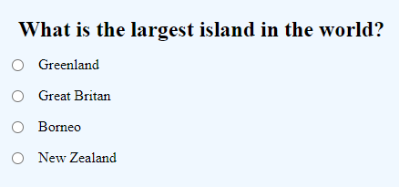
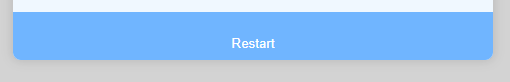

# Quiz

This is an easy four question quiz

## Features

### Existing Features

- _Multiple Choice Section_

    - A choice of 4 answers per question.

- _Score_

    - Producess the result of the quiz at the end.

- _Restart Button_

    - Allows the user to restart the quiz after completion.

### Features Left to Implement

- _Timer_

    - Creating a timed game which creates more of a challenge.

- _Difficulty Settings_

    - Allowing the user to change the difficulty of the questions.

## Testing

### Validator Testing

- HTML
  - No errors were returned when passing through the official W3C HTML Validator
- CSS
  - No errors were found when passing through the official W3C CSS Validator (Jigsaw)

### Unfixed Bugs

- No unfixed bugs

## Credits

- GreatStack youtube tutorial for displaying the questions in the quiz, found here [youtube.com](https://www.youtube.com/watch?v=PBcqGxrr9g8&t=373s&ab_channel=GreatStack)

## Deployment

- The site was deployed to GitHub pages. The steps to deploy are as follows: 
  - In the GitHub repository, navigate to the Settings tab 
  - From the source section drop-down menu, select the Master Branch
  - Once the master branch has been selected, the page will be automatically refreshed with a detailed ribbon display to indicate the successful deployment. 

The live link can be found here - https://lukewtom93.github.io/quiz-pp2/
